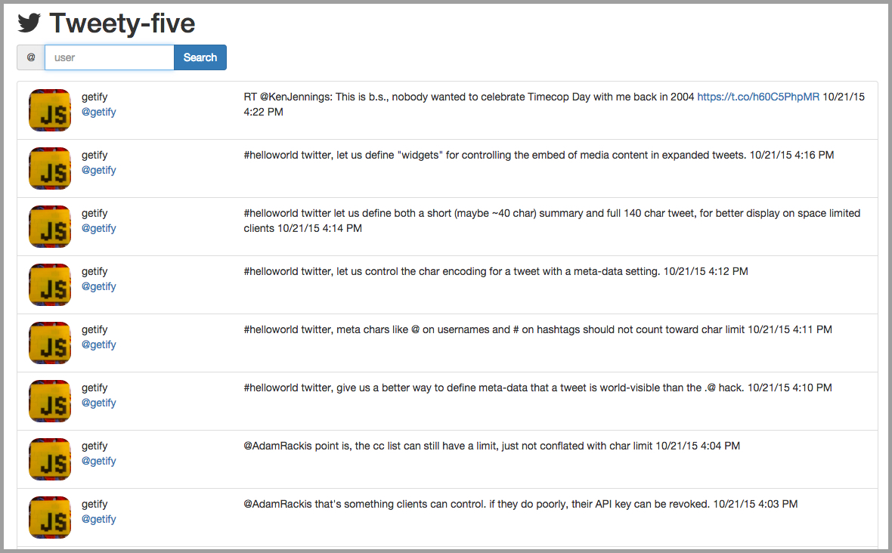

# [Tweety-five](https://aqueous-citadel-1410.herokuapp.com/)

> Tweety-five is an AngularJS application that fetches the 25 most recent tweets from the timeline of a searched-for user.



## Requirements

### Backend
- [Node.js](https://nodejs.org/)
- [Express](http://expressjs.com/)
- [Socket.io](http://socket.io/)
- [twit](https://www.npmjs.com/package/twit)
- [dotenv](https://www.npmjs.com/package/dotenv)

### Frontend
- [AngularJS](https://angularjs.org/)
- [angular-socket-io](https://github.com/btford/angular-socket-io)
- [ngSanitize](https://github.com/angular/angular.js/tree/master/src/ngSanitize)

### Utilities
- [Bower](http://bower.io/)
- [npm](https://www.npmjs.com/)

## Local Development

### Environment Configuration File

Both of the Twitter APIs require any calls to be authenticated using [OAuth](https://dev.twitter.com/oauth), so its necessary to: __1__ have a Twitter account and __2__ be signed in to your Twitter account before registering an application and generating API keys. 

Once signed in, go to [Application Management](https://apps.twitter.com/) and click 'Create New App', then follow the steps. Once an application has been registered, go to 'Keys and Access Tokens' to generate keys for your app.

With API keys generated, add a file called `.env` in the root of the project with the following:
```
consumerKey = ''
consumerSecret = ''
accessToken = ''
accessTokenSecret = ''
```

### Local Development 

With [Bower](http://bower.io/) and [npm](https://www.npmjs.com/#getting-started) installed globally, install dependencies by running the following commands from the terminal:
```
npm install
bower install
```

To start the server, run `node server/server.js`, then open the browser to `localhost:8000`. 

Optionally, [nodemon](http://nodemon.io/), installed globally, can be used for automatic reloads on file changes. Run `nodemon server/server.js`

## Deploying to Heroku

With the [Heroku Toolbelt](https://toolbelt.heroku.com/) installed on your machine and a [Heroku account created](https://signup.heroku.com/?c=70130000001x9jFAAQ), run `heroku login` from the command line to log in. 

Then from the root of the project, run `heroku create`, which creates an app and a git remote called `heroku`, and `git push heroku master` to build and deploy. To ensure an instance of the app is running, run `heroku ps:scale web=1`, then `heroku open` to open the app in the browser. 

Finally, you will have to declare the environmental variables from the `.env` so that Heroku is aware of them. This can be done with a slight change to your existing `.env`, from the command line or from your app's Heroku dashboard. See [here](https://devcenter.heroku.com/articles/getting-started-with-nodejs#define-config-vars) for my details. 

## App Design

For Tweety-five, the first major architectural decision I considered was whether to locate API logic on the client, and use `$http` or `$resource` to manage calls to Twitter, or to locate it server-side, and have the frontend make requests to the server for data. Ultimately, given the scale of this app, either route would have worked fine. I chose to second route, putting API logic on the server, because I wanted to follow a separation of concerns, allowing AngularJS to manage views and user requests and delegating the data retrieval to the server. 

I also thought this organization would make future iterations of the app, in which data would be persisted to a database, would be easier to achieve because the data would already be on the server, making it simple to send it off to the database and the client in one step. Ultimately, there are many ways to handle this question, all of which depends on the scale and complexity of the application.

Beyond the question of where to put API logic, the other design decisions were more straightforward. To streamline calls to Twitter's REST API, I used the [twit](https://www.npmjs.com/package/twit) module. For fast, event-based communication between the server and the client, I used [Socket.io](http://socket.io/). When API calls return successfully, the relevant properties are parsed from the data object, bundle them up into a new response object, and emitted to the client-side socket to be consumed by the front-end.

Client-side, I chose to use AngularJS for its two-data binding and ability to extend the functionality of my markup. To ensure that Socket.io was wired into AngularJS's digest cycle, I used Brian Ford's module [angular-socket-io](https://github.com/btford/angular-socket-io). For responsive design, I included Bootstrap via a CDN because the chances of having a copy of this cached on a user's browser are good, making page load faster. 


